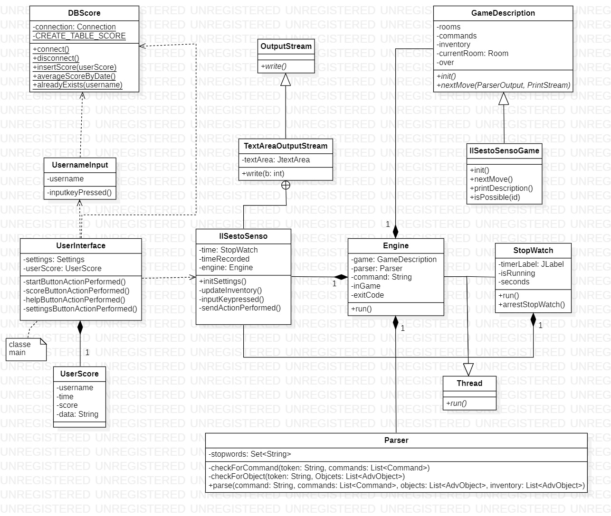
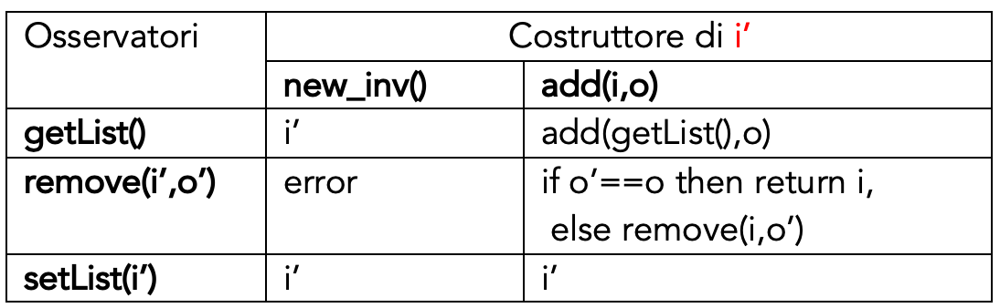

# IL SESTO SENSO
Realizzato da:  
> * _Panfilo Giulia_ **[Matricola: 755423]**
> * _Papeo Raffaele_ **[Matricola: 758421]**
> * _Valecce Camil_ **[Matricola: 758482]**

## Indice
1. [Descrizione del caso di studio](#descrizione-del-caso-di-studio)
2. [Diagramma delle classi](#diagramma-delle-classi)
3. [Specifica algebrica](#specifica-algebrica)
4. [Descrizine argomenti del corso](#descrizione-argomenti-del-corso)

## Descrizione del caso di studio

> É stato richiesto di realizzare un'avventura testuale mostrando le 
> competenze acquisite durante il corso.  
> Un'avventura testuale è un tipo di gioco basato sull'interazione tramite testo, senza grafica.
> Il giocatore utilizza comandi in linguaggio naturale per esplorare ambienti, risolvere enigmi e prendere decisioni che influenzano la trama.  
> Il gioco è un thriller la cui storia si basa sulla ricerca di indizi
> al fine di scoprire la verità.
## Diagramma delle classi

## Specifica algebrica [Inventario]

### Specifica Sintattica
**sorts**: inventory, advobject  
**operators**:
* `new_inventory(inventory, advobject) -> inventory` 
* `add(inventory, advobject) -> inventory`
* `remove(inventory, advobject) -> inventory`
* `setList(inventory) -> inventory`
* `getList() -> advobject`

### Costruttori
**declare** `i,i'` : inventario,` o,o'` :advobject

### Specifica Semantica
**declare** `i,i’` : inventario,` o,o’` :advobject

* `getList(new_inv()) = i’`
* `getList(add(i,o)) = add(getList(),o)`
* `remove(new_inv(), o’) = error`
* `remove(add(i,o),o’) = if o’==o, then return I, else remove(i,o’)`
* `setList(new_inv()) = i’`
* `setList(add(i,o)) = i’`

### Specifica di Restrizione

* `remove(new_inv(),o’)`

## Descrizione argomenti del corso

### FILE
> I file sono stati utilizzati per salvare il finale del gioco e l'help e 
> il testo contenuto verrà caricato e mostrato in output al giocatore.

### DATABASE
> Il database è stato utilizzato per salvare informazioni riguardanti il risultato
> della partita. In particolare sono stati salvati l'username del giocatore, la data,
> il tempo di gioco e il punteggio ottenuto.

### PROGRAMMAZIONE CONCORRENTE
> I thread sono stati utilizzati per mostrare il tempo di gioco e per l'esecuzione
> del motore di gioco.

### SOCKET/RESTFUL
> É stato utilizzato un API di Open Weather per mostrare un messaggio personalizzato 
> in base al meteo.

### SWING
> É stato utilizzato non solo per la realizzazione dell'interfaccia di gioco principale,
> ma anche per tutte le altre schermate, in particolare:
> * Schermata iniziale
> * Punteggi
> * Statistiche
> * Help
> * Impostazioni

### LAMBDA EXPRESSION
> Sono state utilizzate per mostrare alcune statistiche di gioco, in base ai dati
> presenti nel database. In particolare le statistiche mostrate sono state
> * Media dei punteggi
> * Media dei punteggi raggruppati per data
> * Classifica dei 3 migliori giocatori

